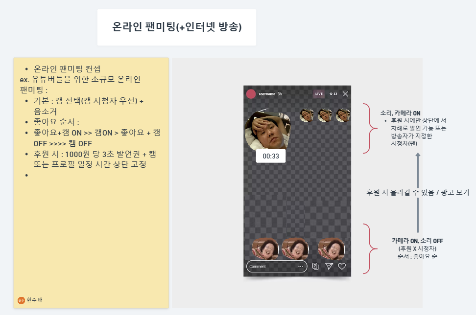

# 공통 PJT 0주차 : 2024.01.06 ~ 2024.01.10

### 1. 아이디어 해커톤
- 웹 기술 (그룹 비디오 컨퍼런스) : 명세서 분석
#### Idea 제시 및 최종 채택 
- '온라인 팬 미팅'이라는 소재와 '인스타/유튜브 라이브' 등의 공개 라이브라는 주제를 합하여 WebRTC를 활용하는 카메라 기반 소통 라이브 플랫폼 WeLive 기획
- 기획 단계에서 해당 엔터테인먼트 도메인에 대한 관심과 해당 서비스의 필요성에 대해 설명하고 최종 Idea까지로 설득하기 위해 WireFrame을 통한 빠른 목업 과정 진행

#### 기획했던 서비스에 대한 MVP를 정리하고, 발표를 위해 단계 수립
- 요구사항 명세 , 페르소나 설정, 고객 여정 맵, 회면 설계도. 기술 스택 선택, 발표 자료
- 팀원과의 아이스브레이킹 및 원만한 업무 분배를 위해 작은 게임을 통해 위에서 요구사항 명세 정리 후, 나머지 업무 분배

----
### 2. 특강 및 학습 1 : 프로젝트 개론\

- PM 구성요소 (4대 + @)
    - Scope Management(범위 관리)요구사항을 명세하고, 기능을 분업 → 각자 일정을 지켜서 구현
    - Time Management : 시간을 초과하면 안됨
    - Cost Management : 원가 초과 하지 않기 / 성공기준 1930초
    - Quality Management : 품질 관리
    - Resource Management : 특히 사람 관리 → communication Man, Risk Management,
    - Procurement Management : 오픈소스나 기존의 것을 구매해서 사용
    중요도 : 통합관리(의사결정 = 리스크와 팀원관계를 고려한 의사결) >> 범위관리 >> 일정관리
    - 통합 관리 : 의사결정, 특히 팀장은 일의 재분배, 일정의 변경 → 의사결정 = 통합관리
- 이해 관계자 관리 : 외부의 관계자와의 소통(프로님, 컨트님 등)
- WBS

----

### 3. 특강 및 학습 2 : 아키텍쳐
- 요구사항 분석 -> 품질속성시나리오 작성(예외 처리 등에 관련된 경우의 수 고려, 4-5개는 필수적으로 써야한다.)

----

### 4. 특강 및 학습 3 : 도커와 쿠버네티스 / 오픈 소스
- 가상머신 -> 클라우드 -> Paas (ex. Vercel)
- VM vs Docker : Docker는 분리만 한다 -> 도커 장점 : 클라우드 이미지 관리 용이

----

### 5. 특강 및 학습 4 : AI 시대의 새 기조('AI 최적화'라는 블루 오션)
- "Attention is All you need", 2017 Google : Transformer Attention =  "관계"를 정의한 알고리즘 및 시스템
- Transformer Attention : 상관 관계의 반복 계산 + 출력 Token의 연속적 수정 및 확률계산 -> 추상화
- 전통적 : 속성값을 지정하고 새로운 속성이 들어온다면 기존의 속성들과의 관계를 고려하여 새 값을 지정
- Residual 및 새 기조 : 새로운 속성이 들어왔을 떼, 그 관계성에 주목하여 관계의 원근에 따라 기존의 속성값도 계속 Update (ex. 소 - 송아지)
- DeepMidn, Alpha Fold의 등장 : Accuracy 40% -> 58% -> 88% 의 초격차 혁명
- 기호주의(인과성) -> 연결주의(상관성) 으로의 트렌드 전환
- 문형래 교수님 결론 : "은유와 추상화 혁명"
----

### 6. 특강 및 학습 5: JIRA의 사용