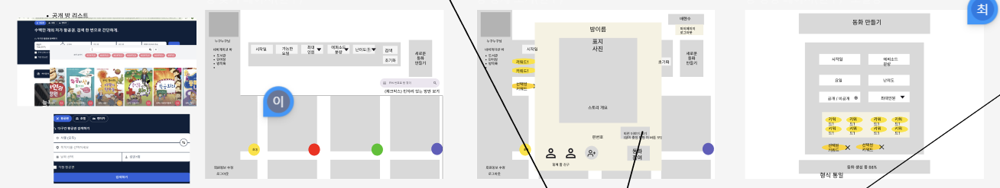
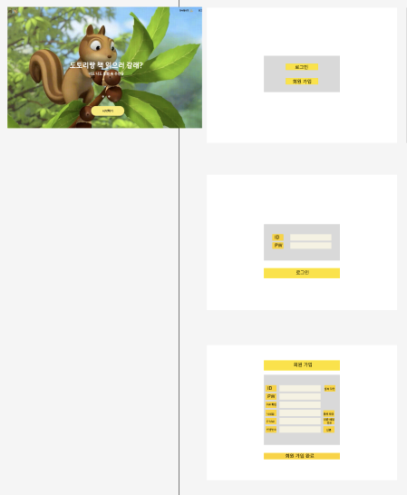

# IDEA 기획 및 설계
## 공통 PJT 1주차 : 2024.01.13 ~ 2024.01.17

### 1. Idea 회의에서의 내 역할(1/13 ~ 1/14)
**1. 나의 아이디어 기획** 
- 어휘 학습을 위한 학습 만화 그리기 플랫폼(최종 채택), 
- 동네 중고 거래 라이브 커머스, 화상 영어 어시스트, 이민자를 위한 온라인 부동산 중개, 온라인 인테리어, 줌 플러스 (Q&A를 위한 장표 자동 캡처 및 인덱싱 시스템),  AI 식재료 분리 및 요리 등

**2. 어휘 학습을 위한 학습 만화 그리기 플랫폼'이라는 주제를 확정 및 설득 및 미팅 준비**
- 기존의 사회 문제였던 학생들의 어휘력 부족 기사에 대한 내용과 시중에 존재하는 온라인 어휘학습 플랫폼 조사를 통해 우리 아이디어만의 차별성 추출 : Open AI를 통해 사용자 선택 기반의 동화 스토리 제작 / 스토리 기반 다인원 만화 그리기 Tool 제공
- 해당 서비스에 대한 수요 조사 : 타겟층인 초등학교 저학년 부모 및 저학년 학생 인터뷰 진행 및 긍정적인 반응 확보
- 어휘 학습에 쓰이는 데이터 사전 조사(한국 교육 평가원 학년별 학습 어휘 목록) 및 Open AI를 통한 프롬포트 엔지니러링 및 스토리라인 Prototype 추출
```
<프롬포트 작성>
사진의 단어를 이용해서 연결되는 3개의 에피소드 스토리를 짜줘. 
그 스토리는 바탕으로 8살 어린아이 4명이서 만화를 그릴거니까, 단어의 설명이 쉽고, 
예시가 쉬운 스토리면 좋겠어. 또한 아이들의 학습을 위한 이야기이므로 동화 느낌이 나면 좋겠어.
```
- 메인 기능 3가지에 대한 구체화 및 레퍼런스 조사 , 추가 기능 정리 : Noion을 이용해 컨설턴트님, 실습 코치님께 아이디어 발표 및 주제 확정


### 2. 화면 명세서 작성 및 Wireframe 작성(1/14 ~ 1/15)
- 팀원과의 상담으로 화면별(도메인별) 기능에 대한 추상적인 확정 -> 해당 기능을 구현한다는 가정으로 와이어프레임 제작
- 와이어프레임 분업 : 로그인, 회원 가입, 방 탐색, 방 상세보기, 키워드 기반 방 생성
<p align="center">
  
  
</p>

### 3. 회면 명세서 기반 요구사항명세서 작성(1/16)
- MVP 기능에서 추가로 붙은 기능들을 다 모오는 과정에 서로 다른 단어 사용을 빚는 팀원 간 소통의 불편함을 페이지별, 기능별로 숫자를 부여하여 체계적인 요구사항 정의서를 완성 (MattetMost/A401/팀 노션/문서/요구사항 명세서)

### 4. 목업 전 디자인 레퍼런스 검색 및 ERD 기반 기능 명세서 (1/16 ~ 진행 중)
- 목업 전 디자인을 맞추기 위한 디자인 레퍼런스 조사

### 5. 목업 & ERD 기반 기능 명세서 확정 (예정)
- 담당 목업(피그마 화면 디자인) : 서비스 랜딩 페이지, 방 탐색, 세션_단어복습퀴즈, 단어장